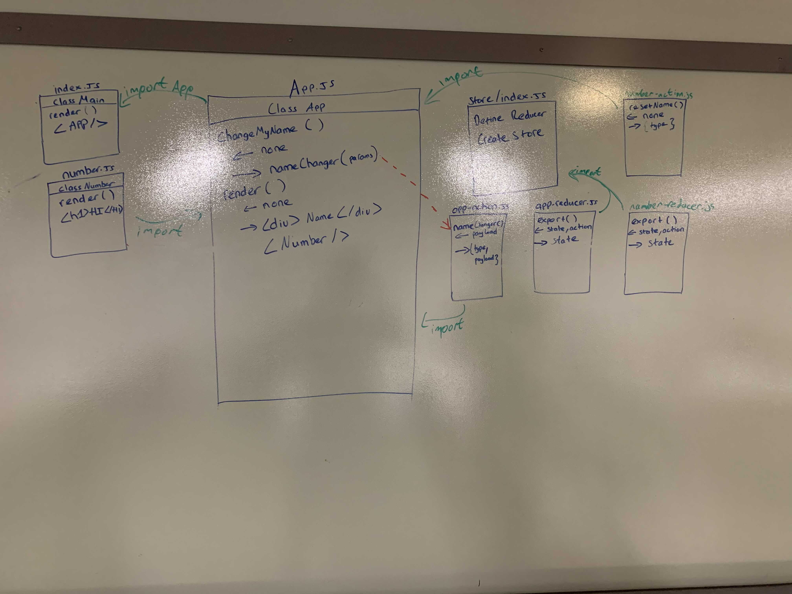

 LAB
=================================================

## Redux Lab 31

### Author: Hai Le

--------------------------------- --------------------------------

### Links and Resources
* [Store-Connect_Sanbox](https://codesandbox.io/s/yvv4976onv)
* [Reduce_Sandbox](https://codesandbox.io/s/4z3yyvk7y9)

--------------------------------- --------------------------------

### Modules

###### `app.scss -> app.js`
Import the stylings into our web application

###### `index.js`
Import app.js and start the APP.

###### `store/index.js`
Import in numbers-reducer and app-reducer.
Export out a function call with method "createStore".

###### `components/Numbers/number.js`
Export into app.js and render the div "Hello" component.

###### `app.js`
constructor() take in `props` and declare the `state`

changeMyName() - return a set of given value and run handleChange function that are pulled in from actions files.

render() - Render the Numbers Class and a div with name gotten from the redux.

Lastly, Export the App, which got called inside index.js

  --------------------------------- --------------------------------

#### Running the app
* On the repl.it Click the `Run` Button to start
* On the codepen just play with the functionalities on `Browsers`

 --------------------------------- --------------------------------

#### UML
Link to an image of the UML for your application and response to events

